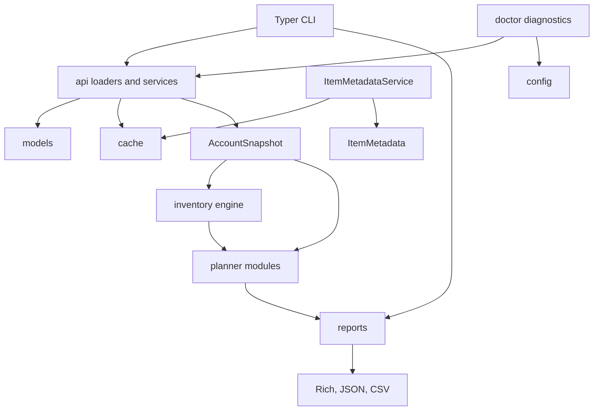

# Architecture

GW2 Legendary Planner is organized as a library-first application. CLI, future
desktop UI, and future automation surfaces should call the same library services.

## Package Layout

- `api/` handles Guild Wars 2 API communication and local JSON export loading.
  It also owns reusable API-backed services such as item metadata lookup.
- `models/` contains Pydantic models for API payloads and normalized snapshots.
- `inventory/` flattens account storage into account-wide item quantities and
  location records.
- `planner/` contains planner-specific data and logic. Legendary focus detection
  recipe evaluation, and activity readiness live here, not inside the inventory
  engine.
- `reports/` adapts domain results to Rich tables, CSV, and JSON.
- `cache/` provides local API response caching.
- `config/` reads settings and API key configuration.
- `diagnostics.py` contains doctor checks for local setup and export validity.
- `tests/` covers loader, inventory, summary, planner, and export behavior.

## Dependency Flow

The dependency direction should stay one-way:

1. API and local loaders create validated data models.
2. Inventory turns snapshots into neutral account item state.
3. Planner modules ask inventory and metadata services domain questions.
4. Reports format already-computed models.

## Boundaries

Inventory aggregation does not know about legendary recipes, item importance, or
recommendations. It only answers:

- Which item IDs exist on the account?
- How many exist?
- Where are they located?
- Which characters hold them?
- Which storage sources contain them?

Planner modules consume inventory and account snapshots to answer domain
questions. Reports consume planner outputs and summaries to format them for a
human or file.

## Local Export Validation

Local JSON exports are validated before they become an `AccountSnapshot`.
Validation catches:

- missing required endpoint exports
- malformed JSON
- wrong top-level payload shapes
- unsupported v1-style export filenames
- Pydantic schema failures

CLI commands catch `LocalExportError` and print fix-oriented messages instead of
tracebacks.

## Item Metadata

`ItemMetadataService` is a reusable API service for `/v2/items`.

It supports:

- `get_item(item_id)` for lazy single-item lookup
- `get_items(item_ids)` for batched lookup
- in-memory reuse during one process
- optional per-item local cache using `ApiCache`
- configurable cache expiration through the cache instance or constructor

The inventory engine stores item IDs and locations only. Metadata enrichment is a
separate service so future planners and UIs can opt in without changing
aggregation behavior.

## Data-Driven Planning

Legendary focus items are stored in `src/gw2_legendary_planner/data/`.
Legendary recipes are stored in `src/gw2_legendary_planner/data/` and loaded
through repository/provider abstractions.
Legendary activity goals are stored in `src/gw2_legendary_planner/data/` and
evaluated against the same account snapshot and inventory engine.
Collection definitions are stored in `src/gw2_legendary_planner/data/` or loaded
from external JSON files and evaluated against neutral account state.

Recipe work follows this pattern:

1. Define validated data models in `planner/`.
2. Store recipe data as package data.
3. Evaluate recipes against `Inventory`, wallet currencies, and account state.
4. Return planner models that can be rendered by any UI.

The current packaged recipe set is intentionally generation-one focused. It
exists to validate the engine shape before broader recipe coverage, activity
planners, market pricing, and recommendation scoring are added.

## Recipe Engine

The recipe engine has three separable pieces:

- `RecipeProvider` loads recipe definitions from one source.
- `RecipeRepository` indexes recipes by recipe id and output item/currency.
- `RecipeEvaluator` evaluates a recipe against `AccountSnapshot` and `Inventory`.

Evaluation returns:

- readiness percentage
- effective missing requirement quantities
- recursive requirement evaluations
- a serializable dependency graph

The evaluator does not query market prices and does not make recommendations.
Those belong to later planner phases.

## Activity Planners

Activity planners model account-progress tasks such as reward tracks and world
completion. The current Phase 3 planner evaluates readiness for Gift of Battle
and Gift of Exploration by checking inventory quantities and locations.

Activity planners return serializable status models with:

- required quantity
- available quantity
- missing quantity
- readiness percentage
- action text
- source URL and tags

Legendary Weapon Starter Kit evaluation is data-backed by a rotation catalog and
reuses the recipe evaluator with virtual kit-provided items. It does not query
trading-post prices.

Collection tracking is data-backed. Item, currency, and legendary armory targets
are evaluated today. Achievement, collection, and account-unlock targets are
represented as unsupported requirements until the matching account data sources
exist.

Wizard's Vault optimization is data-backed. It should not hardcode seasonal
availability in CLI code. Wizard's Vault seasonal reward data lives in
`src/gw2_legendary_planner/data/wizards_vault_seasons.json` or in external
source-verified JSON snapshots loaded through the reusable Wizard's Vault data
service. The optimizer ranks legendary-relevant rewards against the account's
Astral Acclaim balance. Price-derived value and current-season claims remain
outside the optimizer until source data services exist for those concerns.

## Adding New Planners

New planners should live in `planner/` or a planner-specific subpackage. A planner
should:

- accept `AccountSnapshot`, `Inventory`, and optional API services as inputs
- return Pydantic result models
- keep rendering out of planner code
- keep API calls behind service abstractions
- include fixture-based tests for common account states

Do not put planner-specific knowledge in `inventory/`, `api/local.py`, or report
exporters.

## Future GUI

A desktop GUI should call the same services used by the CLI:

1. Load `AccountSnapshot`.
2. Build `Inventory`.
3. Build summaries, focus reports, and future recommendations.
4. Render those models in the GUI layer.

No GUI code should call GW2 API endpoints, parse inventory sources, or evaluate
recipes directly.
